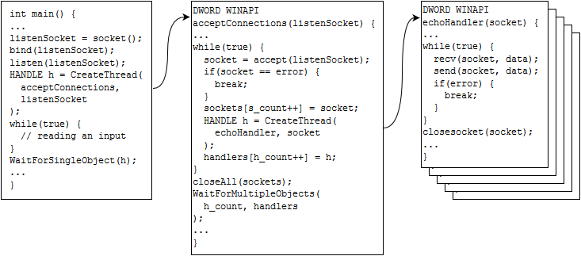

# Содержание

* [Цель работы](#Цель-работы)
* [Индивидуальное задание](#Индивидуальное-задание)
* [Дополнительное задание](#Дополнительное-задание)
* [Программа работы](#Программа-работы)
* [Ход работы](#Ход-работы)
    * [Рассмотрение работы простейшего TCP сервера и клиента](#Рассмотрение-работы-простейшего-tcp-сервера-и-клиента)
        * [TCP](#tcp)
        * [UDP](#udp)
    * [Создание многопоточного TCP-сервера](#Создание-многопоточного-tcp-сервера)
    * [Разработка прикладного протокола](#Разработка-прикладного-протокола)
        * [TCP версия протокола](#tcp-версия-протокола)
        * [UDP версия протокола](#udp-версия-протокола)
            * [Контроль порядка датаграмм](#Контроль-порядка-датаграмм)
            * [Контроль за наличием связи](#Контроль-за-наличием-связи)
    * [Тестирование приложений](#Тестирование-приложений)
        * [TCP приложения](#tcp-приложения)
        * [UDP приложения](#udp-приложения)
    * [Выполнение дополнительного задания](#Выполнение-дополнительного-задания)
        * [Тестирование TCP приложений](#Тестирование-tcp-приложений)
        * [Тестирование UDP приложений](#Тестирование-udp-приложений)
* [Выводы](#Выводы)

# Цель работы

Ознакомиться с принципами программирования собственных протоколов, 
созданных на основе TCP и UDP.

# Индивидуальное задание

Разработать клиент-серверную систему терминального доступа, позволяющую 
клиентам подсоединяться к серверу и выполнять элементарные команды 
операционной системы.

Серверное приложение должно реализовывать следующие функции:
1. Прослушивание определенного порта 
2. Обработка запросов на подключение по этому порту от клиентов
3. Поддержка одновременной работы нескольких терминальных клиентов через механизм нитей
4. Проведение аутентификации клиента на основе полученных имени пользователя и пароля
5. Выполнение команд пользователя: 
    * ls – выдача содержимого каталога
    * cd – смена текущего каталога
    * who – выдача списка зарегистрированных пользователей с указанием их текущего каталога
    * kill – Привилегированная команда. Завершение сеанса другого пользователя
    * logout – выход из системы
6. Принудительное отключение клиента

Клиентское приложение должно реализовывать следующие функции:
1. Установление соединения с сервером
2. Посылка аутентификационных данных клиента (имя и пароль)
3. Посылка одной из команд (ls, cd, who, kill, logout) серверу
4. Получение ответа от сервера
5. Разрыв соединения
6. Обработка ситуации отключения клиента сервером или другим клиентом

# Дополнительное задание

Протестировать программы с помощью сетевого эмулятора netem, чтобы 
эмулировать реальную сеть, с ограниченной пропускной способностью, 
потерей, дублированием, перемешиванием пакетов и ошибками передачи.  
В качестве параметров сети использовать GPRS/EDGE. С помощью Wireshark 
показать, как протокол и протокол транспортного уровня реагируют на 
различные ситуации.

# Программа работы

TCP:
1. Рассмотрение работы простейшего TCP сервера и клиента на ОС Linux и Windows
2. Создание многопоточного сервера на Linux для параллельного обслуживания 
клиенов с использованием средств синхронизации для разделяемых данных
3. Разработка собственного протокола на основе TCP для 
индивидуального задания
4. Реализация прикладного протокола: клиент и многопоточный сервер

UDP:
1. Модификация простейшего сервера и клиента для протокола работы по 
протоколу UDP на ОС Windows и Linux
2. Обеспечение надежности протокола UDP, посредством нумерации пакетов 
и временного контроля активности соединения

Выполнение индивидуального задания

# Ход работы

## Рассмотрение работы простейшего TCP сервера и клиента

Этапы создания серверного и клиентского соединения не отличаются в зависимости от платформы, кроме необходимости на Windows вызывать функцию WSAStartup() перед началом использования сокетов, а также WSACleanup() по завершении работы.

### TCP

В общем случае, для создания TCP-сервера необходимо выполнить следующие системные вызовы:
1. socket() - создает сокет
2. bind() - привязка созданного сокета к заданным IP-адресам и портам
3. listen() - переводит сокет в состояние прослушивания
4. accept() - принимает поступающие запросы на подключение и возвращает сокет для нового соединения
5. recv() - чтение данных от клиента из сокета, возвращенного на предыдущем шаге
6. send() - отправка данных клиенту
7. shutdown() - разрыв соединения с клиентом (может быть инициировано по-разному)
8. close() - для закрытия клиентского и слушающего сокетов

TCP-клиенты, в свою очередь, в простейшем виде выполняют следующую последовательность действий для открытия соединения, отправки и получения данных, а затем - завершения:
1. socket() - точно также создает сокет
2. connect() - установка соединения для сокета, который будет связан с серверным сокетом, порожденным вызовом accept()
3. send() - отправка данных серверу
4. recv() - прием данных от сервера
5. shutdown() - разрыв соединения с сервером
6. close() - закрывает сокет

### UDP

Для создания UDP-сервера не требуется наличие слушающего сокета и отдельных сокетов для каждого клиента, т.к. UDP не устанавливает логическое соединение. Вместе с тем мы можем - если нам угодно - принимать данные от клиентов на одном сокете с хорошо известным портом, а отправлять данные с другого сокета, созданного специально для работы с клиентом, от которого были получены данные. Только клиент должен знать, с какого порта придут данные. Таким образом, при использовании UDP и клиент, и сервер могут меняться ролями.

Но все же, типичным подходом при реализации сервера является выполнение следующих шагов:
1. socket() - первичная функция в мире API сокетов Беркли
2. bind() - сервер должен прослушивать указанный порт на локальном сетевом интерфейсе
3. recvfrom() - получает данные, полученные от клиента, параметры которого заполняются функцией
4. sendto() - отправка данных с указанием параметров клиента, полученных из прердущего шага
5. close() - освобождает сокет

Для UDP-клиент все несколько сложнее. Для клиента могут быть использованы вызовы connect() и bind(), но они не всегда обязательны.

Клиент может вызвать bind(), если нужно, чтобы у сокета был *указанный порт и адрес*, на который можно отправлять серверу данные. В противном случае, при вызове send()/sendto()/recv()/recvfrom() номер порта и сетевой интерфейс будут назначены автоматически. Порт выбирается из [динамического диапазона портов](https://en.wikipedia.org/wiki/Ephemeral_port). А интерфейс - тот, с которого пакеты будут маршрутизироваться при сетевом обмене с сервером.

Функция connect() также может быть применена UDP-клиентом, тогда сокет будет считаться подключенным - нельзя вызывать sendto() на этом сокете, потому что этот вызов - частный случай connect(): вызов sendto() подключает сокет, отправляет датаграмму и отключает сокет. А подключать уже подключенный сокет нельзя. Получается, что использование connect() снижает накладные расходы при отправке данных. Кроме того, если вызвать connect() для адреса сервера и его порта, который закрыт, затем вызвать send(), то вернется ошибка "Connection refused", чего не произошло бы в случае с sendto(). Это так, потому что когда sendto() возвращает управление, стек TCP/IP перестает следить за соединением, ведь сокет уже было отсоединен перед выходом из sendto(). Поэтому ICMP сообщения не доходят до приложения.

Итак, ниже приводится примерная последовательность действий, которые выполняются UDP-клиентом для обмена данными с UDP-сервером:
1. socket() - создает сокет
2. connect() - подключает сокет с параметрами удаленного узла
3. send() - этот вызов выполнит неявный bind() и отправит данные
4. recv() - получит данные с порта и адреса, назначенными автоматически в предыдущем шаге
5. close() - закрывает сокет

## Создание многопоточного TCP-сервера

Чтобы сервер параллельно обрабатывал клиентские подключения, можно каждый сокет, возвращенный из accept(), передавать в отдельный поток, который будет выполнять обмен и все необходимые действия независимо от серверной нити исполнения и других потоков. Если есть разделяемые данные, то доступ к ним должен быть синхронизирован, например, мьютексами.

Схематично работу сервера можно описать алгоритмом, представленным ниже:


Сервер открывает прослушивающий сокет (listenSocket) и запускает поток, в котором, в цикле, принимает входящие TCP-соединения (функция потока acceptConnections()). Параллельное обслуживание клиентов осуществляется благодаря созданию отдельного потока (echoHandler()) под каждый сокет, возвращенный вызовом accept(). Сервер запоминает метаданные о принятом соединении: а) сокет нового соединения; б) дескриптор потока, в котором обслуживается соединение. Кроме того, сервер следит за тем, чтобы общее число соединений не превышало некоторое ограничение, ведь ресурсы системы ограничены. Каждому подключению может назначаться уникальный номер для идентификации соединений и управления ими. Поток, обслуживающий клиентские соединения, в цикле получает данные от клиента и отправляет их обратно. Основной поток сервера читает данные с консоли и обрабатывает команды: завершение работы сервера, отключение клиента от сервера и прочее. Если была запрошена команда завершения сервера, то достаточно закрыть слушающий сокет, что вызовет ошибку, и цикл приема новых подключений прервется. Далее выполняется функция закрытия всех клиентских сокетов. При их закрытии завершатся соответствующие потоки: цикл прервется по ошибке из recv()/send() и поток дойдет до точки прерывания. Сервер после закрытия всех сокетов должен ожидать завершения всех запущенных ранее потоков, а также освободить прочие ресурсы и завершиться.

Данный способ реализации параллельной обработки соединений хорош своей простотой реализации и эффективностью обслуживания, пока число клиентов невелико. Порождение новых потоков - довольно затратная операция. Данная проблема решалась бы созданием пула потоков, если бы на практике число соединений не исчислялось тысячами. Держать десятки потоков - расточительство.

Другой вариант - применение средств мультиплексирования ввода-вывода. В простейшем варианте для этого можно использовать select(): функция ждет событий в наборе отслеживаемых сокетов. Если сокет находится в наборе для чтения данных, то можно применить на активном сокете операцию recv(), обработать запрос (и отправить ответ, если нужно). Если запрос требует длительной обработки, то эту задачу можно отдать в поток/процесс, а результат отправить позже.

Третий вариант - создать пул процессов/потоков (назовем их воркерами) и складывать принятые соединения в общую очередь сокетов. Тогда незанятые воркеры могут ждать появления дескрипторов в очереди, обработать клиентский запрос, а после завершения работы снова возвращаться к ожиданию новых клиентов. Такая модель весьма эффективна и может быть улучшена. Так, можно создать по одному процессу на ядро процессора, а принятые файловые дескрипторы передавать воркерам через механизм передачи файлового дескриптора в Linux (fd-passing) или дублирование сокета (WSADuplicateSocket()) в Windows. Сервер будет распределять сокеты по воркерам в зависимости от их занятости и размера индивидуальной очереди необработанных сокетов. Внутри каждого процесса-воркера может быть по нескольку потоков. В случае, если воркер аварийно завершился, сервер должен создать нового воркера.

Разумеется, это не все возможные приемы для решения задачи параллельной обработки клиентских подключений и данных. Но все эти подходы могут служить основой при реализации сетевых серверных программ.

Вариант с потоками был мною реализован в рамках выполнения индивидуального задания для TCP-сервера на Linux. Там под каждое соединение создавался поток, но не больше 20 потоков в общей сложности. А мультиплексирование I/O я использовал в UDP-сервере на Windows, где также не позволял серверу работать больше, чем с двадцатью клиентами одновременно. Ограничение в 20 клиентов в первом случае обусловлено тем, что не хотелось бы отводить больше двадцати потоков. А во втором - для общности реализация серверов с разными транспортными протоколами: команды в моем индивидуальном задании обычно крайне простые, и можно быстро обрабатывать запросы и переходить к следующим задачам - все в один поток.

Третий вариант я не стал реализовать, поскольку, на мой взгляд, это излишне для лабораторной работы. К тому же у меня уже есть опыт реализации сервера с такой моделью обслуживания.

## Разработка прикладного протокола

Для своего прикладного протокола системы терминального доступа было решено использовать текстовый вариант, а не бинарный: это удобно при тестировании и позволяет использовать telnet в качестве клиента. Кроме того, для данного индивидуального задания разумно использовать модель запросов и ответов: клиенты отправляют команды и аргументы (запросы), а сервер посылает результат обработки команды (ответ). Таким образом, активность проявляет только одна сторона обмена - клиент.

Клиенты для обслуживания сервером и выполнения команд должны пройти процедуру аутентификации по паре из имени пользователя и пароля. Клиенты в системе могут быть с привилегированными правами. Так, у сервера есть список пользователей, обслуживаемый администратором. Этот список хранится в `/tmp/accounts` и состоит из записей - по одной на строку. Пустые строки не допускаются. Формат записи имеет следующий вид: `имя_клиента пароль уровень`:
* имя клиента состоит только из латинских символов;
* пароль не должен содержать пробельных символов и `;`, который используется для разделения этих двух текстовых данных друг от друга при передаче по сети.
* логин и пароль ограничены длиной в 10 символов.
* уровень - это числовое значение, одно из следующих:
    * 2 - предоставить права суперпользователя
    * 1 - у пользователя нет специальных прав
    * 0 - пользователю отказана авторизация

Поддерживаемые команды:
* AUTH - выполнить аутентификацию по паре из имени пользователя и пароля
* LS - показать содержимое заданной директории
* CD - изменить текущую директорию на указанную
* WHO - вывести список всех подключенных к серверу пользователей
* KILL - завершить сеанс другого пользователя: доступно только суперпользователям
* LOGOUT - завершить сеанс

Аргументы команд (не должны превышать 255 символов):
* AUTH - логин и пароль, разделенные символом `;`
* LS - путь директории
* CD - путь директории
* WHO - любая ненулевая последовательность непробельных символов;
* KILL - имя пользователя
* LOGOUT - имя текущего пользователя

В ответ на любой запрос сервер посылается ответ, содержащий код ответа (статус операции) и соответствующее статусу короткое текстовое описание. Перечислим коды ответов и их описание :
* `200 OK` - команда выполнена успешно
* `400 Bad Request` - запрос не соответствует формату, определенным протоколом (о формате для TCP и UDP версий протоколах рассказывается в следующих двух разделах соответственно)
* `403 Forbidden` - отказ в выполнении операции по причине отсутствия разрешения.
* `404 Not Found` - ресурс не найден
* `405 Not a Directory` - запрашиваемый путь не является директорией
* `500 Internal Server Error` - отправляется в том случае, если пользователь не в состоянии сделать так, чтобы его корректный запрос выполнился успешно. Т.е. перечисленные выше ошибки (кроме OK) дают ясно понять, что вызвало проблему (в контексте выполнения команды) и почему вина лежит на пользователе, и что пользователь может предпринять (перестать пытаться зайти в `/root`). Но если на серверной стороне удалить файл с базой пользователей, то клиенту легче не станет от того, что прочтет ошибку "550 User Accounts Lost" вместо "500 Internal Server Error".

Статус выполнения команд, присылаемый в ответе, имеет различные смысловые оттенки в непосредственной зависимости от команды, для которой сформирован ответ:
* AUTH
    * Forbidden - если клиент ввел неправильный пароль, несуществующее имя или все вместе
    * Bad Request - если аргумент содержит слишком длинные логин или пароль; логин состоит не только из латинских символов; если не считан пароль, потому что отделен не символом-разделителем `;`; нет пароля
* LS и CD:
    * Forbidden - доступ к каталогу запрещен
    * Not Found - директории с указанным имененем не существует
    * Not a Directory - попытка выполнить операцию не над каталогом
* KILL
    * Forbidden - операция разрешена только суперпользователям; нельзя выполнить KILL для завершения собственных сеансов - для этого есть LOGOUT
    * Not Found - указанный в аргументе пользователь не имеет активного сеанса на сервере
* LOGOUT
    * Bad Request - необходимо указать имя пользователя текущего сеанса

### TCP версия протокола

В связи с тем, что TCP — потоковый протокол, программно невозможно разделить присылаемые данные на сообщения напрямую. Для этого можно использовать несколько подходов. Например, можно заканчивать сообщение определенным символом-разделителем, но тогда считывать из сокета придется побайтно или блоками фиксированной длины. Первое неэффективно, потому что каждое обращение к recv() - это системный вызов, выполняющийся только ради извлечения одного байта. Второе можно реализовать и это будет приемлемо для чтения небольших данных. Другим вариантом решения вышеназванной проблемы является пересылка перед сообщением его длины.

Клиентские запросы формируются из имени команды и аргумента, разделенных пробельным символом. Запрос должен заканчиваться последовательностью символов `\r\n`. Длина аргумента не должна превышать 255 байт. В результате запрос выглядит так: `имя_команды аргумент\r\n`

Таким образом, сервер может считывать запросы, пока не встретит символ-разделитель - клиенту не нужно считать длину, а сервер выполнят чтение запроса минимум в два приема (см. код функции [readcrlf()](../tcp/lib/efunc.c), что достаточно эффективно. Отмечу, что readcrlf() корректно работает, даже если в качестве разделителя имеется только лишь символ `\n`.

В свою очередь, каждый ответ начинается со строки (заголовка ответа), содержащей длину сообщения (тела ответа), числового кода результата операции (статус) и короткого текстового описания результата обработки запроса. Строка завершается последовательностью `\r\n`. Отсюда - формат заголовка (без тела): `0 статус текстовое_описание\r\n`

Если длина тела сообщения ненулевая, то добавляется ровно одна пустая строка (`\r\n`), отделяющая заголовок ответа от тела с произвольными данными указанной в заголовке длины. Причем длина всегда задается большей на 2 байта, чем записано реальных данных в тело - учитываются два символа в пустой строке, чтобы клиент мог за один вызов функции [readn()](../tcp/lib/efunc.c) получить все сообщение целиком, не компенсируя два байта. Тогда формат ответа с непустым сообщением выглядит таким образом: `длина_тела статус текстовое_описание\r\n\r\n<сообщение>`

Сообщение может состоять из неопределенного объема данных и произвольного числа строк, поэтому организовать клиенту чтение многострочного тела сообщения не так просто. С другой стороны, можно было бы передавать одну строку, содержащую ответ и закодированные символы перевода строки, но это лишает пользователя возможности работать из telnet клиента. Поэтому было решено, что только первая строка ответа считывается до разделителя, а затем выполняется функция чтения всего тела.

В итоге в реализации протокола используется сразу два подхода - запросы и заголовок ответа обязательно оканчиваются на `\r\n`, а тело ответа вычитывается с помощью длины из заголовка.

### UDP версия протокола

Протокол UDP  также является транспортным протоколом, однако в отличие от TCP, он не обеспечивает ни гарантированную доставку пакетов, ни правильность порядка их получения. К тому же, UDP не устанавливает логического соединение и ориентирован на передачу сообщений (датаграмм). Один вызов sendto() соответствует одной датаграмме, что приводит к необходимости контролировать размер пакетов. Так как UDP упаковывается в IP пакет, длина которого вместе с заголовком не может превышать 65535 байт, то длина данных внутри UDP пакета должна быть не больше [65507 байт](https://en.wikipedia.org/wiki/User_Datagram_Protocol#Packet_structure). Помимо того, при запрещенной фрагментации IP пакетов может потребоваться уменьшить их размер до кадров Ethernet (примерно 1500 байт) или другой используемой среды канального уровня.

Будем считать, что фрагментация поддерживается и размер передаваемых данных всегда меньше 64KB. Тогда важно решить еще две проблемы: а) корректно обрабатывать приход датаграмм в неправильном порядке; б) следить за состоянием подключения: одна из сторон обмена могла прекратить работу без уведомления, а также могла произойти авария сетевого оборудования.

Решение обозначенных выше проблем на уровне выше транспортного не приблизит UDP к TCP, но позволит реализовать достаточно устойчивое UDP-приложение. Этому вопросу посвящен отдельный раздел "Совет 8. Не надо заново изобретать TCP" в книге Й. Снейдера "Эффективное программирование TCP/IP".

#### Контроль порядка датаграмм

Таким образом, для проверки соответствия между ответами и запросами необходимо снабдить каждый запрос и ответ уникальным идентификатором в рамках клиентской сессии: клиент начинает передачу запроса с номером 1, а сервер принимает такой запрос для данного клиента, идентифицируемого по IP и порту, потому что предыдущий номер запроса был равен 0. Сервер запоминает номер последнего запроса и отправляет клиенту ответ с таким же номером - 1. Каждый запрос увеличивает номер на единицу. В конце концов, если от клиента придет запрос с меньшим номером, чем зафиксирован сервером ранее, то сервер проигнорирует данные - датаграмма где-то затерялась и пришла позже, чем успел прийти более новый пакет (с большим номером). Если номер запроса равен текущему номеру у сервера, то произошло дублирование пакета. Только если пришел запрос с номером, который превышает текущий у сервера, то сервер такой запрос обработает. Причем если превышение на два и более, то запросы от клиента не доходили. Аналогично должен поступать и клиент: сравнивать свой текущий номер запроса с номером ответа от сервера (т.е. клиент должен игнорировать старые и принимать только новые ответы).

Модифицировал TCP-версию протокола, чтобы получить его UDP аналог с учетом контроля соответствия между запросом и ответом. Получил следующий формат:
* запросов: `номер_запроса имя_команды аргумент\r\n`.
* ответов: `номер_ответа статус текстовое_описание\r\n\n<сообщение>`

Поле `длина_тела` из формата ответа исчезло. Это связано с особенностью работы UDP: если 10KB данных отправлено, фрагментировано во время передачи и собрано на конечно узле, то можно датаграмму считать всю разом, а recv() вернет размер посылки.

> Ответы "400 Bad Request" отправляются с номером 0, потому что если запрос не содержал своего уникального номера, то неясно, с каким номером отправлять ответ. Если удалось серверу извлечь номер запроса, а оставшаяся часть не может быть распарсена, то ответ с кодом 400 отправится с извлеченным номером.

#### Контроль за наличием связи

Для обнаружения проблем, вызванных крахом систем на одном из сторон обмена, аварией сетевого оборудования или чрезмерно низкой пропускной способностью сети (теряющей, портящей, задерживающей пакеты) и другими сетевыми сбоями, был реализован механизм пульсаций. Его суть описана в "Совете 10..." уже упомянутой книги Й. Снейдера. Коротко опишу отличия моей реализации:
* для сообщений-пульсов не был введен отдельный тип MSG_HEARTBEAT. Приложения понимают, что получено сообщение-пульс по нулевой длине, возвращаемой из recv(). Это позволяет минимальными усилиями и без изменения протокола имплементировать механизм пульсаций. К тому же это чуть-чуть экономит интернет трафик.
* клиент не только следит за доступностью удаленного узла, но и контролирует, чтобы с момента отправки запроса не было получено больше трех пульсов от сервера. На четвертое сообщение-пульс клиент сообщит о превышении времени ожидания ответа.
* сервер следит за состоянием соединения с клиентами на основе времени, а не числа пропущенных сообщений-импульсов. Это так, потому что один клиент может прождать период T1 + T2, и тогда сервер должен прерываться раз в T2 секунд и увеличивать счетчик пропущенных сообщений от клиента. Только если клиентов много, то непонятно, какой из них просрочил отправку данных. Поэтому у меня сервер прерывается раз в T1 + T2 секунд и проверяет, сколько времени прошло с момента последней активности каждого клиента.

## Тестирование приложений

На Linux-хосте установлена VirtualBox, запускающая виртуальную машину с Windows 7. VirtualBox создает сетевой итерфейс vboxnet0 для связи хоста и виртуальной машины. Хост на этом сетевом интерфейсе имеет адрес 192.168.56.1, а адрес виртуальной машины - 192.168.56.101.

Клиенты для двух транспортных протоколов полностью абстрагируют детали реализации прикладного протокола: консольный интерфейс у них одинаковый, и команды они выполняют ровно те же самые. Вдобавок клиентским приложениям все равно, в каком регистре были введены команды - все они будут преобразованы в верхний регистр. Также стоит отметить, что команды LS, CD и WHO, введенные в клиенте без аргумента, получат аргумент по умолчанию - символ точки. Команде WHO, напомню, без разницы, что передать в качестве аргумента. Похожая ситуация с командой LOGOUT - ей в аргументе задается имя пользователя, и не важно, что пользователь далее вписал что-то другое.

### TCP приложения

Для тестирования сервера на Linux, собрал debug версию проекта, чтобы можно было использовать возможности ThreadSanitizer - динамического анализатора наличия состояний гонок.

Запустим сервер, принимающего подключения по адресу 192.168.56.101 и порту 5001, с выводом отладочной информации в файл log:

```
max@darkstar:/home/max/Documents/.do/ne│max@darkstar:/home/max/Documents/.do/net
t/NetworksLab2017/tcp/build$ ./server_d│gNetworksLab2017/tcp/build$ tail -f log 
ebug 192.168.56.1 5001 2>log           │[main] starting the server...           
>                                      │[handler] initializing...               
                                       │[terminal] starting...                  
                                       │[terminal] started                      
                                       │[server] new peer: 4                    
                                       │[handler] new peer sfd=4                
                                       │[service] auth: ok                      
                                       │[service] chdir=/    
```
Окно клиента:
```
C:\Users\IEUser\Desktop\NetworksLab2017\tcp\build>client 192.168.56.1 5001
Username: first
Password:
Successful authentication

first:/$
```
Видно, что клиент успешно подключился и сменил директорию на `/`.

Подключим еще одного клиента из telnet (на Windows):
```
C:\Users\IEUser>telnet
telnet> o 192.168.56.1 5001
Trying 192.168.56.1...
Connected to 192.168.56.1.
Escape character is '^]'.
```
И посмотрим на сервере с помощью команды "status" список подключенных клиентов:
```
> status                               │[handler] initializing...               
Online peers: 2                        │[terminal] starting...                  
Served peers for all time: 2           │[terminal] started                      
Peer #1                                │[server] new peer: 4                    
        IP address: 192.168.56.101     │[handler] new peer sfd=4                
        Port: 49190                    │[service] auth: ok                      
        Socket: 4                      │[service] chdir=/                       
        Username: first                │[server] new peer: 5 // новый клиент
        CWD: /                         │[handler] new peer sfd=5                
        Mode: 2                        │[terminal] showing statistics // запуск status
Peer #2                                │[handler] foreach                       
        IP address: 192.168.56.101     │[peer] no cache for Peer#1              
        Port: 49191                    │[peer] no cache for Peer#2              
        Socket: 5                      │                                        
        Not authorised                 │                                        
> 
```
Мы видим, что второй клиент не авторизован, а у первого есть права суперпользователя. Можем получить информацию об IP-адресах и портах клиентов. Стоит обратить внимание на то, что у клиентских портов номера из динамического диапазона портов.

Выполним команду WHO на telnet-клиенте от имени неавторизованного клиента:
```
WHO .
0 403 Forbidden
```
Без авторизации ни одна команда не выполнится. Видим, что у ответа нулевая длина в теле сообщения.

Выполним ту же команду через клиент системы терминального доступа:
```
first:/$ who
ID      UNAME   MODE    CWD
1       first   2       /
TOTAL: 1

first:/$
```
В выводе команды видим идентификатор пользователя на время сессии, имя, права доступа и текущую директорию.

Попробуем выполнить команду CD:
```
first:/$ cd home/max/VirtualBox VMs
first:/home/max/VirtualBox VMs$
```
Приглашение в командном интерпретаторе поменялось: теперь оно содержит текущую директорию. Запустим `ls` (аналог `LS .`) и затем `ls .././../friend/../max/..`:
```
first:/home/max/VirtualBox VMs$ ls
win7/
linx/

first:/home/max/VirtualBox VMs$ ls .././../friend/../max/..
friend/
lost+found/
ftp/
max/
box/

first:/home/max/VirtualBox VMs$
```
Сперва вывелось содержимое `/home/max/VirtualBox`, а потом - домашнего каталога, при этом текущая директория не изменилась - проверим это на сервере:
```
> status                               │[handler] new peer sfd=4                
Online peers: 2                        │[service] auth: ok  
Served peers for all time: 2           │[service] chdir=/   
Peer #1                                │[server] new peer: 5                    
        IP address: 192.168.56.101     │[handler] new peer sfd=5                
        Port: 49190                    │[terminal] showing statistics           
        Socket: 4                      │[handler] foreach   
        Username: first                │[peer] no cache for Peer#1              
        CWD: /home/max/VirtualBox VMs  │[peer] no cache for Peer#2              
        Mode: 2                        │[handler] foreach   
Peer #2                                │[service] chdir=/home/max/VirtualBox VMs
        IP address: 192.168.56.101     │or directory        
        Port: 49191                    │[terminal] showing statistics           
        Socket: 5                      │[handler] foreach   
        Not authorised                 │
>                                      |
```

Пройдем процедуру аутентификации на telnet-клиенте:
```
AUTH second;tokio
27 200 OK

Successful authentication
```
Выполним WHO из клиента от имени first и попробуем выполнить KILL с разными именами пользователей:
```
first:/home/max/VirtualBox VMs$ who
ID      UNAME   MODE    CWD
1       first   2       /home/max/VirtualBox VMs
2       second  1       /
TOTAL: 2

first:/home/max/VirtualBox VMs$ kill first
KILL: Forbidden
first:/home/max/VirtualBox VMs$ kill third
KILL: Not Found
first:/home/max/VirtualBox VMs$ kill second
first:/home/max/VirtualBox VMs$ who
ID      UNAME   MODE    CWD
1       first   2       /home/max/VirtualBox VMs
TOTAL: 1

first:/home/max/VirtualBox VMs$
```
Завершим сессию first:
```
first:/home/max/VirtualBox VMs$ logout

C:\Users\IEUser\Desktop\NetworksLab2017\tcp\build>
```
Посмотрим, что происходит на сервере:
```
> status                               │[handler] foreach   
Online peers: 0                        │[handler] delete all
Served peers for all time: 2           │[handler] delete all
>                                      │[handler] Deleting the peer #2: sfd=5, t
                                       │id=3495937792       
                                       │[handler] foreach   
                                       │[service] logout: username=first        
                                       │[handler] Deleting #1: sfd=4, tid=350433                    
                                       │0496                    
                                       │[terminal] showing statistics           
                                       │[handler] foreach
```
За все время работы сервера было обслужено два клиента, и на момент запуска "status" нет ни одного соединения.

Проверим, освобождены ли ресурсы: файловые дескрипторы, сокеты и нет ли незавершенных потоков:
```
max@darkstar:/home/max/Documents/.do/net/NetworksLab2017/tcp/build$ pgrep server_debug
30779
max@darkstar:/home/max/Documents/.do/net/NetworksLab2017/tcp/build$ ps -p 30779 -Lo f,s,uid,pid,ppid,lwp,wchan,cmd
F S   PID  PPID   LWP WCHAN  CMD
0 S 30779 29792 30779 futex_ ./server_debug 192.168.56.1 5001
1 S 30779 29792 30780 hrtime ./server_debug 192.168.56.1 5001
1 S 30779 29792 30781 futex_ ./server_debug 192.168.56.1 5001
1 S 30779 29792 30782 inet_c ./server_debug 192.168.56.1 5001
1 S 30779 29792 30783 wait_w ./server_debug 192.168.56.1 5001
```
Поток с флагом 0 - основной. Есть еще поток сервера, поток логгера и поток терминала, работающего с пользовательским вводом. Один поток порожден ThreadSanitizer-ом.

Выведем список открытых файловых дескрипторов, включая сокеты:
```
max@darkstar:/home/max/Documents/.do/net/NetworksLab2017/tcp/build$ lsof -d 0-100 -a -p 30779 
COMMAND     PID USER   FD   TYPE  DEVICE SIZE/OFF    NODE NAME
server_de 30779  max    0u   CHR   136,1      0t0       4 /dev/pts/1
server_de 30779  max    1u   CHR   136,1      0t0       4 /dev/pts/1
server_de 30779  max    2w   REG     8,4      545 1310942 /home/max/Documents/.do/net/NetworksLab2017/tcp/build/log
server_de 30779  max    3u  IPv4 2937714      0t0     TCP 192.168.56.1:commplex-link (LISTEN)
```
У процесса открыты только три файла: консольный ввод-вывод, вывод в файл и сокет в состоянии прослушивания.

Подключим еще двух клиентов и проверим список пользователя с консоли сервера:
```
Online peers: 2                        │[service] chdir=/  
Served peers for all time: 5           │[handler] foreach  
Peer #3                                │[service] logout: username=third       
        IP address: 192.168.56.101     │[handler] Deleting #4: sfd=7, tid=112091
        Port: 49282                    │3152
        Socket: 6                      │[server] new peer: 8                   
        Username: second               │[handler] new peer sfd=8               
        CWD: /                         │[service] auth: ok 
        Mode: 1                        │[service] chdir=/  
Peer #5                                │[handler] foreach  
        IP address: 192.168.56.101     │[terminal] showing statistics          
        Port: 49286                    │[handler] foreach  
        Socket: 8                      │[peer] no cache for Peer#3             
        Username: fourth               │[peer] no cache for Peer#5             
        CWD: /                         │[terminal] showing statistics           
        Mode: 2                        │[handler] foreach   
>                                      │
```
Обращу внимание на то, что был подключен клиент three, после чего он вышел (видно из логов и по идентификационному номеру 5 у пользователя fourth). Теперь с консоли отключу пользователя second по его ID командой "k":
```
        CWD: /                         │[terminal] kill 3   
        Mode: 2                        │[handler] delete first                  
> k 3                                  │[handler] Deleting the peer #3: sfd=6, t
>                                      │id=1129305856
```
Пользователь удален. Попробуем выполнить команду из терминала пользователя second:
```
second:/$ logout
readcrlf() failed:
An existing connection was forcibly closed by the remote host.
```

А теперь завершим сервер с подключенным клиентом командой "q":
```
        Socket: 8                      │[terminal] shutdown requested           
        Username: fourth               │[terminal] joining...                   
        CWD: /                         │[handler] destroing...                  
        Mode: 2                        │[handler] delete all                    
> k 1                                  │[handler] Deleting the peer #5: sfd=8, t
> q                                    │id=1120913152       
max@darkstar:/home/max/Documents/.do/ne│[main] server has shut down
```
Клиент fourth отключится при попытке обратиться к серверу.

Таким образом, сервер успешно выполняет работу по обслуживанию клиентских подключений и обработке запросов. Все ресурсы высвобождаются по мере необходимости.

### UDP приложения

Сервер запущен в Windows, а клиент связывается с хоста на Linux. Работа клиента и сервера в функциональном плане совпадает с работой под TCP. Все команды выполняются так же. Однако пользоваться telnet-клиентом уже нельзя, потому что он использует TCP. Есть еще netcat - он может устанавливать соединения по UDP и походит в качестве инструмента для "сырого" общения с сервером. Единственный нюанс - нельзя долго простаивать, иначе сервер перестанет обслуживать клиента и придется производить аутентификацию заново:
```
max@darkstar:/home/max/Documents/.do/net/NetworksLab2017/udp/build$ nc -u 192.168.56.101 5001
1 AUTH third;paris
1 200 OK

Successful authentication2 WHO .
2 WHO .
2 200 OK

ID	UNAME	MODE	CWD
1	third	1	C:\
TOTAL: 1
2 WHO .
1 WHO .
# Подождем секунд 20
0 400 Bad Request
3 LS .
3 403 Forbidden
```
Вот, что в это время происходило на сервере:
```
[terminal] starting...
[main] starting the server...
[terminal] started
[handler] initializing...
[server] received "1 AUTH third;paris
"
[handler] adding peer...
[handler] peer was added to the array
[service] auth: ok
[service] parsed=0, to send 37
[server] received "WHO .
"
[termproto] No matching values
[service] parsed=-1, to send 19
[server] received "2 WHO .
"
[service] parsed=0, to send 53
[server] received "2 WHO .
"
[handler] received unordered request: peer.seq=2, req.seq=2
[server] received "1 WHO .
"
[handler] received unordered request: peer.seq=2, req.seq=1
[server] received "# Подождем секунд 20
"
[termproto] No matching values
[service] parsed=-1, to send 19
[peer] caching an address and a port
[handler] Deleting the peer #1: ip=192.168.56.1, port=57543
[server] received "3 LS .
"
[handler] adding peer...
[handler] peer was added to the array
[service] parsed=0, to send 17
[peer] caching an address and a port
[handler] Deleting the peer #2: ip=192.168.56.1, port=57543
```
После примерно двадцати секунд бездействия, сервер "отключил" клиент, освободив структуры данных, связанных с этим клиентом. Клиент затем попытался получить результат команды LS, но тот уже был лишен авторизации.

Обращу внимание, что каждый запрос и ответ начинается с соответствующего номера. И действительно, когда два раза были отправлены команды WHO с номером 2 и 1, то сервер проигнорировал данные и ничего не ответил. По логами видны уведомления о получении данных с ошибочным порядком: "received unordered request".

Теперь попробуем подключиться к серверу из специально разработанного клиентского приложения и попробовать выполнить различные сценарии для разных команд.

* CD и LS:
    
    LS без аргумента вывела текущую директорию.
    ```
    third#C:\$ Ls
    $Recycle.Bin\
    autoexec.bat
    CMake\
    config.sys
    Documents and Settings
    empty\
    MinGW\
    pagefile.sys
    PerfLogs\
    Program Files\
    ProgramData
    Recovery
    System Volume Information\
    Users\
    Wallpaper\
    Windows\
    ```
    ---
    Переход в каталог `C:\MinGW`, выполнили LS, указав относительный путь к каталогу Downloads пользователя IEUser.
    ```
    third#C:\$ cd MinGW	
    third#C:\MinGW$ ls ..\users\ieuser\Downloads
    4.exe
    desktop.ini
    dump.pcapng
    dump_udp_linux.pcapng
    dump_udp_windows.pcapng
    dump_windows.pcapng
    ```
    ---
    Еще одна команда с относительным путем, который ведет к `C:\MinGW`.
    ```
    third#C:\MinGW$ ls ..\.\windows\..\mingw\.\
    bin\
    include\
    lib\
    libexec\
    mingw32\
    msys\
    share\
    var\
    ```
    ---
    Переход в каталог bin и выполнение ls. Вывод сокращен для удобства.
    ```
    third#C:\MinGW$ cd bin
    third#C:\MinGW\bin$ ls
    aclocal
    aclocal-1.10
    < ... вывод пропущен ... >
    xgettext.exe
    zlib1.dll
    ```
    ---
    Попытки перейти в каталог или показатель содержимое каталога, к которому нет доступа или которого не существует, или указанный путь не является каталогом.
    ```
    third#C:\MinGW\bin$ cd zlib1.dll
    CD: Not a Directory
    third#C:\MinGW\bin$ cd zlib1
    CD: Not Found
    third#C:\MinGW\bin$ cd \Program Data
    CD: Not Found
    third#C:\MinGW\bin$ cd \Program Files
    third#C:\Program Files$ cd \PerfLogs
    CD: Forbidden
    third#C:\Program Files$ ls \PerfLogs
    LS: Forbidden
    third#C:\Program Files$ cd \mingw\bin
    third#C:\mingw\bin$ ls zlib1.dll
    LS: Not a Directory
    third#C:\mingw\bin$ ls zlib1 
    LS: Not Found
    ```
    ---
    Переход между разными разделами файловой системы.
    ```
    third#C:\mingw\bin$ cd D:
    third#D:\$ ls
    3\
    4\
    CPUSTRES\
    ProcessExplorer\
    2\
    1\

    third#D:\$ cd C:
    third#C:\Users\IEUser\Desktop\NetworksLab2017\udp\build$ 
    ```
* WHO

    Вызов команды без параметров и с бессмысленным набором символов:
    ```
    third#C:\$ who
    ID	UNAME	MODE	CWD
    6	third	1	C:\
    TOTAL: 1

    third#C:\$ who saffowiefjds;a
    ID	UNAME	MODE	CWD
    6	third	1	C:\
    TOTAL: 1

    third#C:\$
    ```
    ---
    Добавим больше клиентов и выведем список пользователей:
    ```
    third#C:\$ who
    ID	UNAME	MODE	CWD
    6	third	1	C:\Program Files
    7	first	2	C:\
    8	second	1	C:\
    9	first	2	C:\
    10	third	1	C:\
    11	first	2	C:\
    12	fourth	2	C:\
    13  second  1   C:\
    TOTAL: 8
    ```
* KILL
    
    Непривилегированные пользователи (third, second) не могут выполнять данную команду:
    ```
    second#C:\$ kill
    Usage: kill username
    second#C:\$ kill first 
    KILL: Forbidden
    second#C:\$ kill second
    KILL: Forbidden
    second#C:\$ kill third
    KILL: Forbidden
    ```
    ---
    Суперпользователи не могут завершить с помощью KILL собственные соединения, однако могут завершать другие 
    ```
    fourth#C:\$ kill fourth                
    KILL: Forbidden    
    fourth#C:\$ kill second                
    fourth#C:\$ who    
    ID      UNAME   MODE    CWD            
    6       third   1       C:\Program Files
    7       first   2       C:\            
    9       first   2       C:\            
    10      third   1       C:\            
    11      first   2       C:\            
    12      fourth  2       C:\            
    TOTAL: 6 
    ```
    В итоге два сеанса пользователя second были завершены. Сервер перестанет отвечать на сообщения-пульсы от клиентов пользователя second и те отключатся:
    ```
    second#C:\$ 
    
    Connection dead
    ```
    ---
    Попробуем завершить сеансы пользователя, который:
    * не существует
        ```
        first#C:\$ kill anonymous
        KILL: Not Found            
        ```
    * есть в соответствующей базе на стороне сервера, но не имеет ни одного активного сеанса
        ```
        first#C:\$ kill second
        KILL: Not Found
        ```
    В обоих случаях получили ошибку о том, что такого пользователя нет. Т.е. учитывается только то, действительно ли указанный пользователь имеет активное подключение или нет.

Работу команды AUTH лучше рассмотреть на примере подключения к серверу из netcat. Попробуем подключаться с разными значениями аргумента - имени пользователя и пароля:

* имя пользователя больше 10 символов
    ```
    1 AUTH 1234567890ab;hello
    1 400 Bad Request
    ```
* пароль больше 10 символов
    ```
    1 AUTH first;moscow7890abcd
    1 403 Forbidden

    Unable to log in
    ```
    Аутентификация не пройдена. Можно предположить, что если бы пароль в пределах первых десяти символов был верен, то оставшиеся символы просто были бы проигнорированы. Для проверки создан новый пользователь с максимально длинным паролем, и опыт был повторен:
    ```
    1 AUTH test;1234567890_extra
    1 200 OK

    Successful authentication
    ```
    Да, присланные данные сверх ожидаемого не помешали удачно произвести аутентификацию.
* имя пользователя не указано:
    ```
    1 AUTH ;passwd
    1 400 Bad Request
    ```
    Запрос не удовлетворяет формату, описанному в протоколе.
* пропущен пароль
    ```
    1 AUTH username
    1 400 Bad Request
    ```
* имя пользователя содержит не латинские символы:
    ```
    1 AUTH user_name;password
    1 400 Bad Request
    ```
* используется некорректный разделитель:
    ```
    1 AUTH user password
    1 400 Bad Request
    ```
Выше были представлены не все случаи и комбинации, однако можно сказать, что аутентификация реализована достаточно надежно, если не брать во внимание то, что пароли передаются и хранятся в открытом виде и имеют крайне короткую длину.

Команду LOGOUT также, как и AUTH можно рассмотреть только из netcat, потому что клиент не позволяет отправлять в аргументе этой команды ничего, кроме имени пользователя - как этого требует протокол. LOGOUT довольно проста: сервер знает, что пользователь с именем first и со своим IP и портом прошел аутентификацию под конкретным именем, тогда команда должна содержать только это имя в аргументе:
```
2 LOGOUT second
2 400 Bad Request
3 LOGOUT anonymous
3 400 Bad Request
4 LOGOUT first
4 200 OK
```

## Выполнение дополнительного задания

Для тестирования приложения в условиях работы реальной сети воспользовался утилитой __tc__ ([traffic control](https://en.wikipedia.org/wiki/Tc_(Linux))), которая позволяет управлять работой [планировщика пакетов](https://en.wikipedia.org/wiki/Network_scheduler#Linux_kernel) в ядре Linux. С помощью tc можно задать различные алгоритмы обработки очереди сетевых пакетов - дисциплины (сокращенно *qdisc*). Дисциплиной по умолчанию у сетевых интерфейсов является *prio_fast*, причем каждый интерфейс имеет корневую дисциплину (*root qdisc*). Проверим это на примере интерфейса виртуальной сети vboxnet0, выполнив команду вида `tc [ FORMAT ] qdisc show [ dev DEV ]` (см. [man tc(8)](https://www.linux.org/docs/man8/tc.html)):
```
root@darkstar:~# tc -s qdisc show dev vboxnet0 # показать настройки для vboxnet0
qdisc pfifo_fast 0: root refcnt 2 bands 3 priomap  1 2 2 2 1 2 0 0 1 1 1 1 1 1 1 1
 Sent 33251704 bytes 137056 pkt (dropped 0, overlimits 0 requeues 0) 
 backlog 0b 0p requeues 0 
```

Дисциплина *netem* умеет эмулировать потери, дублировать, искажать и перемешивать пакеты, а также добавлять задержки с различной функцией распределения и ограничивать пропускную способность (см [man tc-netem(8)](https://www.linux.org/docs/man8/tc-netem.html) и [первую ссылку в Google](https://wiki.linuxfoundation.org/networking/netem) по запросу "netem"). Однако __все манипуляции производятся только над исходящим траффиком__ с интерфейса, со стороны которого задана дисциплина с заданными опциями. В данном случае весь трафик с Windows не будем подвергаться изменению, т.к. он считается входящим.

Сперва посмотрим, как функционировали TCP приложения до изменения дисциплины на интерфейсе. Пусть сервер на Linux слушает интерфейс vboxnet0 по адресу 192.168.56.1:5001.
```
max@darkstar:$ ./server 192.168.56.1 5001
[main] starting the server...
[handler] initializing...
[terminal] starting...
[terminal] started
```
Запустим tcpdump с фильтром захвата "host 192.168.56.1 and tcp", чтобы оставить только пакеты, в которых есть указанный IP адрес и TCP заголовки. Вывод сохраним в файл tcp_normal_linux.
```
root@darkstar:~# tcpdump -w tcp_normal_linux tcp and host 192.168.56.1
```
На Windows запустим Wireshark и начнем прослушивать тот же интерфейс с теми же настройками захвата. Запустим клиента и подключимся к серверу, выполним авторизацию и завершим сессию.
```
# окно клиента
C:\>client.exe 192.168.56.1 5001
Username: first
Password:
Successful authentication

first:/$ logout

# вывод сообщений сервера
[server] new peer: 4
[handler] new peer sfd=4
[service] auth: ok
[service] chdir=/
[service] logout: username=first
[handler] Deleting #1: sfd=4, tid=4287735552
```
Затем завершим работу снифферов на Windows и на Linux. Дамп траффика, снятого Wireshark-ом, сохраним с именем tcp_normal_windows.

Просмотрим результаты:
* tcp_normal_windows:
    ```
    No.     Time           Source                Destination           
          1 0.000000       192.168.56.101        192.168.56.1          54546 → 5001 [SYN] Seq=0 Win=8192 Len=0 MSS=1460 WS=256 SACK_PERM=1
          2 0.000308       192.168.56.1          192.168.56.101        5001 → 54546 [SYN, ACK] Seq=0 Ack=1 Win=29200 Len=0 MSS=1460 SACK_PERM=1 WS=128
          3 0.000049       192.168.56.101        192.168.56.1          54546 → 5001 [ACK] Seq=1 Ack=1 Win=65536 Len=0
          4 2.827053       192.168.56.101        192.168.56.1          54546 → 5001 [PSH, ACK] Seq=1 Ack=1 Win=65536 Len=19
          5 0.000327       192.168.56.1          192.168.56.101        5001 → 54546 [ACK] Seq=1 Ack=20 Win=29312 Len=0
          6 0.000009       192.168.56.1          192.168.56.101        5001 → 54546 [PSH, ACK] Seq=1 Ack=20 Win=29312 Len=40
          7 0.000595       192.168.56.101        192.168.56.1          54546 → 5001 [PSH, ACK] Seq=20 Ack=41 Win=65536 Len=6
          8 0.000267       192.168.56.1          192.168.56.101        5001 → 54546 [PSH, ACK] Seq=41 Ack=26 Win=29312 Len=15
          9 0.201661       192.168.56.101        192.168.56.1          54546 → 5001 [ACK] Seq=26 Ack=56 Win=65536 Len=0
         10 1.087690       192.168.56.101        192.168.56.1          54546 → 5001 [PSH, ACK] Seq=26 Ack=56 Win=65536 Len=14
         11 0.000335       192.168.56.1          192.168.56.101        5001 → 54546 [PSH, ACK] Seq=56 Ack=40 Win=29312 Len=10
         12 0.000330       192.168.56.1          192.168.56.101        5001 → 54546 [FIN, ACK] Seq=66 Ack=40 Win=29312 Len=0
         13 0.000053       192.168.56.101        192.168.56.1          54546 → 5001 [ACK] Seq=40 Ack=67 Win=65536 Len=0
         14 0.000271       192.168.56.101        192.168.56.1          54546 → 5001 [FIN, ACK] Seq=40 Ack=67 Win=65536 Len=0
         15 0.000291       192.168.56.1          192.168.56.101        5001 → 54546 [ACK] Seq=67 Ack=41 Win=29312 Len=0
    ```
* tcp_normal_linux:
    ```
    No.     Time           Source                Destination           
          1 0.000000       192.168.56.101        192.168.56.1          54546 → 5001 [SYN] Seq=0 Win=8192 Len=0 MSS=1460 WS=256 SACK_PERM=1
          2 0.000033       192.168.56.1          192.168.56.101        5001 → 54546 [SYN, ACK] Seq=0 Ack=1 Win=29200 Len=0 MSS=1460 SACK_PERM=1 WS=128
          3 0.000326       192.168.56.101        192.168.56.1          54546 → 5001 [ACK] Seq=1 Ack=1 Win=65536 Len=0
          4 2.826750       192.168.56.101        192.168.56.1          54546 → 5001 [PSH, ACK] Seq=1 Ack=1 Win=65536 Len=19
          5 0.000051       192.168.56.1          192.168.56.101        5001 → 54546 [ACK] Seq=1 Ack=20 Win=29312 Len=0
          6 0.000142       192.168.56.1          192.168.56.101        5001 → 54546 [PSH, ACK] Seq=1 Ack=20 Win=29312 Len=40
          7 0.000715       192.168.56.101        192.168.56.1          54546 → 5001 [PSH, ACK] Seq=20 Ack=41 Win=65536 Len=6
          8 0.000088       192.168.56.1          192.168.56.101        5001 → 54546 [PSH, ACK] Seq=41 Ack=26 Win=29312 Len=15
          9 0.202136       192.168.56.101        192.168.56.1          54546 → 5001 [ACK] Seq=26 Ack=56 Win=65536 Len=0
         10 1.087171       192.168.56.101        192.168.56.1          54546 → 5001 [PSH, ACK] Seq=26 Ack=56 Win=65536 Len=14
         11 0.000132       192.168.56.1          192.168.56.101        5001 → 54546 [PSH, ACK] Seq=56 Ack=40 Win=29312 Len=10
         12 0.000179       192.168.56.1          192.168.56.101        5001 → 54546 [FIN, ACK] Seq=66 Ack=40 Win=29312 Len=0
         13 0.000364       192.168.56.101        192.168.56.1          54546 → 5001 [ACK] Seq=40 Ack=67 Win=65536 Len=0
         14 0.000276       192.168.56.101        192.168.56.1          54546 → 5001 [FIN, ACK] Seq=40 Ack=67 Win=65536 Len=0
         15 0.000036       192.168.56.1          192.168.56.101        5001 → 54546 [ACK] Seq=67 Ack=41 Win=29312 Len=0
    ```
Содержимое дампов не отличается друг от друга, за исключением значений времени, прошедшего с момента захвата предыдущего пакета. Мы видим, как клиент инициировал соединение (пакеты 1-3), отправив TCP пакет с флагом SYN и произвольным числом seq=J (здесь seq=0, только потому что Wireshark умеет преобразовывать изначальный порядковый номер для простоты анализа сетевого трафика). Затем от сервера последовал ответ с флагами SYN и ACK, при этом номер подтверждения ack увеличен на единицу (J+1), а изначальный порядковый номер seq=K (здесь он тоже равен 0). Клиент возвращает еще один пакет с флагом ACK и номером подтверждения K+1.

К этому моменту и клиентский, и серверный сокеты находятся в состоянии ESTABLISHED, т.е. соединение между ними установлено. С 4 по 11 пакеты происходит передача данных с подтверждением доставки. При обмене данными приемная сторона использует номер последовательности, содержащийся в получаемых сегментах, чтобы управлять левым краем окна приема. Принимающая сторона уведомляет передающую сторону о номере последовательности, до которой он успешно получил данные, записывая его в номер подтверждения ack. Передающая сторона, получив сегмент с флагом ACK, смещает окно передачи на число подтвержденных байт.

С 12 по 15 байты происходит завершение соединения, инициированное сервером, т.к. мы видим, как сервер отправляет первым сегмент с флагом FIN и числом seq=M (66 в данном случае). Клиент на это отвечает пакетом с флагом ACK и числом seq=M+1. Затем клиент отправляет FIN с числом seq=N (40), и сервер отвечает сегментом с флагом ACK и числом seq=N+1. К этому моменту соединение закрыто.

Во время работы по протоколу UDP при анализе сетевого трафика (если не будет сбоев) мы увидим только шесть пакетов, потому что во время работы клиент сделал запросы: 1) на аутентификацию (AUTH); 2) на смену директории, чтобы запросить текущий путь (`CD .`); а затем - на завершение сеанса (LOGOUT). А сервер должен ответить по одному разу. Ни установления соединения, ни его разрыва не требуется, также как нет киких-либо датаграмм с подтверждением получения.

Теперь можно перейти к тестированию приложений с эмулированием реальной сети.

### Тестирование TCP приложений


### Тестирование UDP приложений


# Выводы

